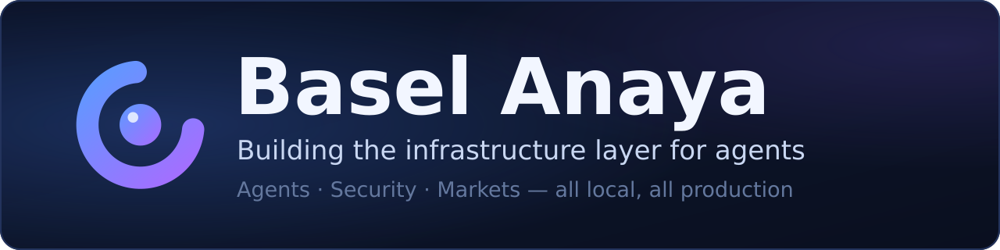
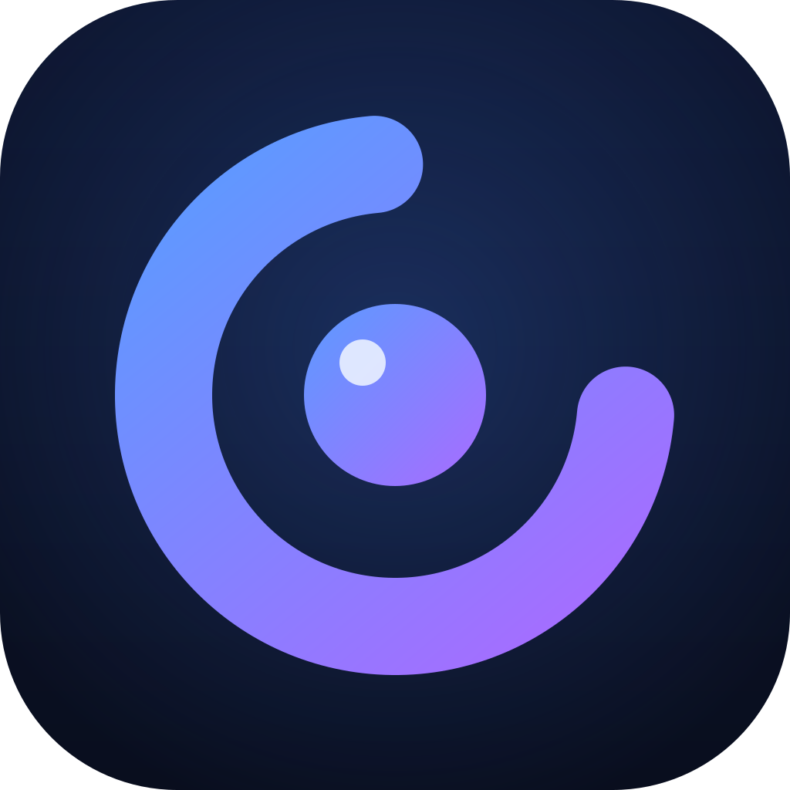

<div align="center">



[](https://linkedin.com/in/Basel-anaya)
[](https://maximlabs.co)
[](#)

**AI Infrastructure Engineer · Solo Founder @ [Maximlabs](https://maximlabs.co)**

*Agents. Security. Markets. All local. All production.*

</div>

---

## [⬢ Cirax](https://github.com/baselanaya/Cirax) — now shipping

<div align="center">



**An invisible AI copilot that floats over your screen — sees what you see,<br>hears your meetings, and stays hidden from screen shares.**

[](https://github.com/baselanaya/Cirax/releases)
[](https://github.com/baselanaya/Cirax/actions/workflows/ci.yml)
[]()
[](https://github.com/baselanaya/Cirax/blob/main/LICENSE)

</div>

A free, self-hosted Cluely alternative. BYOK — OpenAI, Anthropic, Gemini, Azure, or any OpenAI-compatible endpoint — with everything sensitive staying on your machine:

- **Stealth where the OS allows it** — `WDA_EXCLUDEFROMCAPTURE` on Windows; honest per-platform reporting everywhere else (no fake promises)
- **Local Whisper STT** — microphone + meeting audio transcribed offline, keys encrypted via the OS keyring
- **Eye-contact camera companion** — a virtual webcam that corrects your gaze while you read answers, driven by a MobileGaze network at ~7 ms/frame on CPU
- **Real releases** — CI-built Linux x64/arm64 AppImages and a Windows installer on every version tag

`Electron` · `JavaScript` · `Whisper.cpp` · `ONNX Runtime` · `MediaPipe`

---

## Projects

| | |
|---|---|
| 🔐 **[Kernex](https://github.com/baselanaya/Kernex)** — zero-trust execution hypervisor for AI agents. A single static Rust binary that sandboxes any agent at the OS level with **Landlock LSM + seccomp BPF** — before the process boots. Audit mode generates least-privilege policies by observing one run; **< 2 ms overhead** vs ~500 ms for Docker. <br/>`Rust` `Landlock` `seccomp` `MCP` | 🗄️ **[Mercer](https://github.com/baselanaya/Mercer)** — text-to-SQL for messy production schemas. Six-stage agentic pipeline on a consumer GPU, no vector DB. **74% execution accuracy** on stratified benchmarks with Qwen2.5-Coder-7B, 100% on window functions. <br/>`Python` `llama.cpp` `Triton` `FastAPI` |
| 📈 **[Cynosure](https://github.com/baselanaya/Cynosure)** — fully local autonomous trading system for OKX perpetual swaps. A local Qwen3.5-4B synthesizer reads a ~500-token expert signal brief each 15-min cycle; deterministic Python owns all risk logic. Zero cloud LLM dependency. <br/>`Python` `TimesFM 2.5` `Ollama` `OKX` | 🗣️ **[Valerie](https://github.com/baselanaya/Valerie)** — visual speech recognition. A 500M-parameter VALLR-based lip-reading model that transcribes speech from video alone. <br/>`Python` `PyTorch` |
| 🛡️ **[Orion](https://github.com/baselanaya/Orion)** — self-hosted privacy VPN. Obfuscated WireGuard with a Tor-enforced Ghost mode. <br/>`Rust` `WireGuard` `Tor` | 🎬 **[Atlas](https://github.com/baselanaya/Atlas)** — multi-model AI soundtrack generation playground for cinematic and game composers. <br/>`Python` |
| 👻 **[RemnantUE5](https://github.com/baselanaya/RemnantUE5)** — first-person horror survival game in Unreal Engine 5.8, built as SAE Institute coursework. <br/>`C++` `UE5` | 🌐 **[Maximlabs](https://maximlabs.co)** — the umbrella for all of it: infrastructure for agents that run locally, execute safely, and act under clear rules. |

---

## Stack

<div align="center">

**Languages**


**Inference & ML**


**Systems & Infra**


</div>

---

## Stats

<div align="center">


<br /><br />


</div>

---

<div align="center">

```
systems programming  ·  LLM inference  ·  agentic infrastructure  ·  kernel security
```

[maximlabs.co](https://maximlabs.co) · [LinkedIn](https://linkedin.com/in/Basel-anaya) · Amman, Jordan

</div>
